# AUTHORA Database Schema

## Entity Relationship Diagram

```mermaid
erDiagram
    users ||--o{ profiles : has
    users ||--o{ user_preferences : has
    users ||--o{ writing_styles : has
    users ||--o{ projects : owns
    users ||--o{ sessions : has
    users ||--o{ goals : has
    users ||--o{ achievements : earns
    users ||--o{ user_stats : has
    users ||--o{ accountability_settings : has
    users ||--o{ notifications : receives
    users ||--o{ audit_logs : generates
    users ||--o{ reminders : has
    users ||--o{ analytics_events : generates

    projects ||--o{ books : contains
    projects ||--o{ notes : contains

    book_types ||--o{ books : "type of"
    books ||--o{ book_settings : has
    books ||--o{ chapters : contains
    books ||--o{ ghostwriter_workspaces : has
    books ||--o{ fiction_workspaces : has
    books ||--o{ nonfiction_workspaces : has
    books ||--o{ export_jobs : exports
    books ||--o{ publishing_assets : has

    chapters ||--o{ chapter_versions : "version history"
    chapters ||--o{ chapter_briefs : has
    chapters ||--o{ fiction_scenes : contains
    chapters ||--o{ content_highlights : has
    chapters ||--o{ content_comments : has
    chapters ||--o{ ai_revisions : has

    notes ||--o{ note_attachments : has
    notes ||--o{ note_highlights : has
    notes ||--o{ note_comments : has

    ghostwriter_workspaces ||--o{ chapter_briefs : has
    ghostwriter_workspaces ||--o{ ghostwriter_sessions : has

    writing_plans ||--o{ chapter_targets : has
    writing_plans ||--o{ milestones : has

    user_journeys ||--o{ journey_tasks : has
    phases ||--o{ journey_tasks : "phase of"

    users {
        uuid id PK
        string email UK
        string hashed_password
        string display_name
        bool is_active
        bool is_admin
        timestamp created_at
        timestamp updated_at
    }

    profiles {
        uuid user_id PK,FK
        string bio
        string avatar_url
        string timezone
        timestamp created_at
        timestamp updated_at
    }

    user_preferences {
        uuid user_id PK,FK
        jsonb preferences
        timestamp created_at
        timestamp updated_at
    }

    writing_styles {
        uuid id PK
        uuid user_id FK
        string name
        string voice_tone
        jsonb style_rules
        bool is_default
        timestamp created_at
        timestamp updated_at
    }

    book_types {
        string id PK
        string name
        string description
        int sort_order
    }

    books {
        uuid id PK
        uuid project_id FK
        string book_type_id FK
        string title
        string genre
        jsonb planner_data
        timestamp created_at
        timestamp updated_at
        timestamp deleted_at
    }

    book_settings {
        uuid book_id PK,FK
        jsonb settings
        timestamp created_at
        timestamp updated_at
    }

    chapters {
        uuid id PK
        uuid book_id FK
        string title
        int sort_order
        jsonb content
        int word_count
        string section_status
        string content_source
        timestamp created_at
        timestamp updated_at
        timestamp deleted_at
    }

    chapter_versions {
        uuid id PK
        uuid chapter_id FK
        jsonb content
        int word_count
        uuid created_by FK
        timestamp created_at
    }

    notes {
        uuid id PK
        uuid project_id FK
        uuid book_id FK
        uuid chapter_id FK
        uuid user_id FK
        string title
        text content
        string note_type
        jsonb tags
        bool pinned
        timestamp created_at
        timestamp updated_at
        timestamp deleted_at
    }

    ai_revisions {
        uuid id PK
        uuid chapter_id FK
        uuid user_id FK
        string action_id
        text original_text
        text suggested_text
        string status
        timestamp created_at
    }

    reminders {
        uuid id PK
        uuid user_id FK
        string reminder_type
        string scheduled_time
        bool is_active
        timestamp created_at
        timestamp last_triggered_at
    }

    analytics_events {
        uuid id PK
        uuid user_id FK
        string event_type
        string resource_type
        string resource_id
        jsonb properties
        timestamp created_at
    }

    publishing_assets {
        uuid id PK
        uuid book_id FK
        string asset_type
        string file_key
        jsonb metadata
        timestamp created_at
    }

    feature_flags {
        string key PK
        bool enabled
        jsonb rules
        timestamp updated_at
    }

    setup_state {
        string key PK
        jsonb value
        timestamp updated_at
    }
```

## Table Summary

| Table | Purpose |
|-------|---------|
| **users** | Core account (email, password, display_name, is_admin) |
| **profiles** | Extended user profile (bio, avatar, timezone) |
| **user_preferences** | User preferences (JSONB) |
| **writing_styles** | Per-user writing voice/style presets |
| **book_types** | Reference: fiction, nonfiction, etc. |
| **books** | Book (project_id, book_type_id, title, genre) |
| **book_settings** | Per-book settings (JSONB) |
| **phases** | Reference: idea, concept, outline, drafting, etc. |
| **chapters** | Chapter (book_id, content JSONB, word_count) |
| **chapter_versions** | Version history for chapters |
| **fiction_scenes** | Scene cards (chapter_id, POV, beat) |
| **chapter_sections** | Optional section hierarchy within chapter |
| **notes** | Research, ideas, scratchpad |
| **note_attachments** | File attachments for notes |
| **content_highlights** | Highlights in chapter/note content |
| **content_comments** | Comments on chapter/note |
| **reference_items** | Citations, links, references |
| **ai_action_registry** | Static AI action definitions |
| **ai_revisions** | AI suggestion/revision history (was ai_suggestions) |
| **ghostwriter_workspaces** | Ghostwriter mode state per book |
| **ghostwriter_sessions** | Session log for ghostwriter runs |
| **goals** | Writing goals (target_words, deadline) |
| **reminders** | Scheduled reminders |
| **milestones** | Milestones within writing plans |
| **streak_logs** | Daily streak data |
| **user_stats** | XP, level, streaks |
| **badge_definitions** | Static badge catalog |
| **achievements** | Earned badges |
| **analytics_events** | Event tracking |
| **export_jobs** | Export request tracking |
| **publishing_assets** | Cover, metadata, etc. |
| **notifications** | In-app notifications |
| **audit_logs** | Security audit trail |
| **feature_flags** | Feature toggles |
| **setup_state** | Setup wizard state |

## Audit Fields

All main tables include:
- `created_at` (timestamp with timezone)
- `updated_at` (timestamp with timezone, on update)

Tables with user attribution:
- `created_by` (user_id) where applicable

## Soft Delete Strategy

Tables with soft delete (`deleted_at`):
- `books` – preserve for analytics, restore possible
- `chapters` – preserve version history
- `notes` – preserve research trail
- `projects` – preserve for undelete

Default filter: `WHERE deleted_at IS NULL` for list/get operations.
Hard delete: admin action or retention policy.

## Indexes

| Table | Index | Columns |
|-------|-------|---------|
| users | ix_users_email | email (unique) |
| books | ix_books_project_id | project_id |
| books | ix_books_deleted_at | deleted_at |
| chapters | ix_chapters_book_id | book_id |
| chapters | ix_chapters_sort_order | book_id, sort_order |
| notes | ix_notes_project_id | project_id |
| notes | ix_notes_book_id | book_id |
| notes | ix_notes_user_id | user_id |
| notes | ix_notes_ts_content | content (GIN tsvector) |
| audit_logs | ix_audit_logs_user_id | user_id |
| audit_logs | ix_audit_logs_created_at | created_at |
| analytics_events | ix_analytics_events_user_type | user_id, event_type |
| analytics_events | ix_analytics_events_created_at | created_at |

## Constraints

- `books.type` → FK to `book_types.id` (or CHECK fiction|nonfiction)
- `chapters.section_status` → CHECK (draft|revised|final)
- `goals.target_words` → CHECK (> 0)
- `user_stats.xp` → CHECK (>= 0)
- Unique: (user_id, quest_date) on daily_quests
- Unique: (user_id, week_start) on weekly_missions
